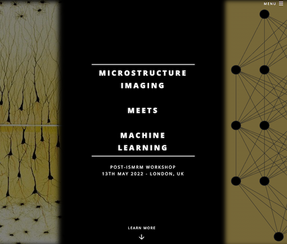

<table style="border:hidden">
   <tr>
     <td style="border:hidden">
        
     </td>
     <td>
       <a href="http://cmic.cs.ucl.ac.uk/miml/index.html">MIML 2022 - Microstructure Imaging Meets Machine Learning</a>
       <ul>
         <li>
           <a href="assets/docs/MIML2022/talks/T01-DannyAlexander.pdf">Danny Alexander's slides</a>
         </li>
         <li>
           <a href="assets/docs/MIML2022/talks/T03-KurtSchilling.pdf">Kurt Schilling's slides</a>
         </li>
         <li>
           <a href="assets/docs/MIML2022/talks/T04-FrancescoGrussu.pdf">Francesco Grussu's slides</a>
         </li>
         <li>
           <a href="assets/docs/MIML2022/talks/T05-SeanEpstein.pdf">Sean Epstein's slides</a>
         </li>
         <li>
           <a href="assets/docs/MIML2022/talks/T07-TingGong.pdf">Ting Gong's slides</a>
         </li>
         <li>
           <a href="assets/docs/MIML2022/talks/T09-PeterNeher.pdf">Peter Neher's slides</a>
         </li>
         <li>
           <a href="assets/docs/MIML2022/talks/T10-MaximeChamberland.pdf">Maxime Chamberland's slides</a>
         </li>
       </ul>
     </td>
   </tr>
</table>
