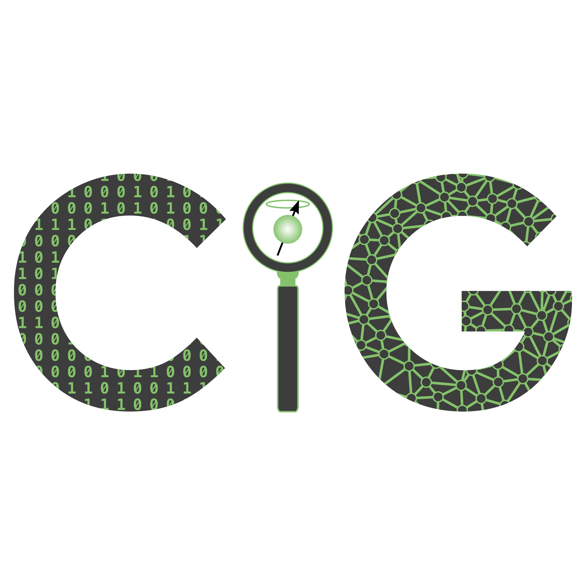

{::options parse_block_html="true" /}

 

# Computational Imaging Group @ UCL

We develop advanced techniques for acquiring and analysing medical images, using cutting-edge computational approaches, such as numerical simulation and machine learning.

Our research has a particular focus on quantitative Magnetic Resonance Imaging (qMRI) and its application in medicine.  qMRI techniques hold tremendous potential for improving the quality of diagnostic information MRI scanners can provide to clinicians.  However this potential is yet to be realised due to various significant technical barriers.

Our vision is to make qMRI techniques clinically viable and relevant.  To do this, we are harnessing modern computational advances, such as deep learning, and working closely with our clinical collaborators to ensure that we target areas of real clinical importance.  Ultimately, we believe that these approaches will enable us to realise the full potential of qMRI in the clinic - delivering the most informative and reliable diagnostic data from MRI for patient care.

  

*An [example](https://seancepstein.github.io/publications/task-driven-assessment.html) of CIG's application of computational techniques to improve qMRI clinical utility*
{: .text-center }
