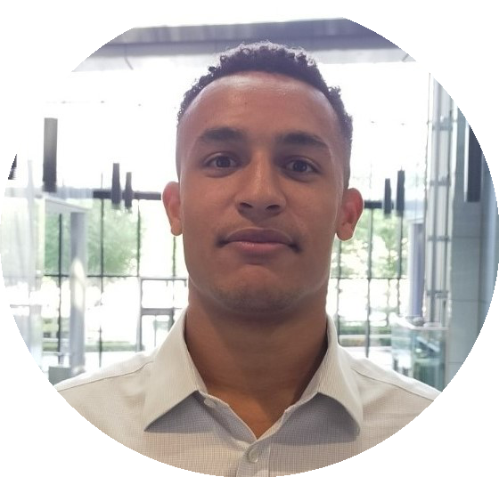

## Academics
<!--- In alphabetic order by first names--->

<ul>

   <li style="display: flex; justify-content: flex-start; align-items: center">
      
      
 &nbsp; 

      
 <a href="https://iris.ucl.ac.uk/iris/browse/profile?upi=HZHAN50">Gary Zhang</a> is a computer scientist and Professor of Computational Imaging. He also directs the UCL EPSRC Centre for Doctoral Training in Intelligent, Integrated Imaging in Healthcare (<a href="https://www.ucl.ac.uk/intelligent-imaging-healthcare/">i4health</a>). 

   </li>

   <li style="display: flex; justify-content: flex-start; align-items: center">
      
      
 &nbsp; 

      
 <a href="https://www.ucl.ac.uk/medical-imaging/staff/principal-investigators/professor-margaret-hall-craggs">Margaret Hall-Craggs</a> is a consultant radiologist and Professor of Medical Imaging with a particular interest in magnetic resonance imaging. She is a fellow and silver medal winner of the International Society for Magnetic Resonance in Medicine (ISMRM). 

   </li>
   
   <li style="display: flex; justify-content: flex-start; align-items: center">
      
      
 &nbsp; 

      
 <a href="https://TJPBray.github.io/">Tim Bray</a> is an NIHR Clinical Lecturer and honorary consultant radiologist using computational techniques for quantitative MRI. He is a junior fellow of the International Society for Magnetic Resonance in Medicine (ISMRM). 

   </li>

</ul>

## Post-doctoral researchers
<!--- In alphabetic order by first names--->

<ul>

   <li style="display: flex; justify-content: flex-start; align-items: center">
      
      
 &nbsp; 

      
 <a href="https://scholar.google.com/citations?user=iV_JtqIAAAAJ&hl=fr">Antoine Legouhy</a> is interested in: brain morphology, registration, atlasing (then); deep-learning registration, geometric distortion correction (now). 
 
   </li>
   
   <li style="display: flex; justify-content: flex-start; align-items: center">
      
      
 &nbsp; 

      
 <a href="https://csparker.github.io/about">Christopher Parker</a> develops and applies models of brain microstructure to evaluate and stage neurodegenerative disease. 

   </li>
   
   <li style="display: flex; justify-content: flex-start; align-items: center">
      
      
 &nbsp; 

      
 <a href="https://scholar.google.com/citations?user=F9tsdJMAAAAJ&hl=en&oi=sra/">Michele Guerreri</a> develops and applies biophysical models for diffusion MRI. 

   </li>
   
   <li style="display: flex; justify-content: flex-start; align-items: center">
      
      
 &nbsp; 

      
 <a href="https://scholar.google.co.in/citations?user=B3gkCIEAAAAJ&hl=en">Prabhjot Kaur </a> is interested in developing machine learning methods to assess and improve the quality of medical images. 

   </li>
     
   <li style="display: flex; justify-content: flex-start; align-items: center">
      
      
 &nbsp; 

      
 <a href="https://tinggong.github.io/">Ting Gong</a> is interested in developing microstructure imaging methods with MRI and machine learning. 

   </li>
   
</ul>

## PhD students
<!--- In alphabetic order by first names--->

<ul>
   
   <li style="display: flex; justify-content: flex-start; align-items: center">
      
      
 &nbsp; 

      
 <a href="https://06lamba.github.io/">Alistair Lamb</a> applies statistics and deep learning to quantitative Whole-Body MRI. 

   </li>

   <li style="display: flex; justify-content: flex-start; align-items: center">
      
      
 &nbsp; 

      
 <a href="https://seancepstein.github.io/">Sean Epstein</a> applies deep learning to medical imaging inverse problems. 

   </li>
   
   <li style="display: flex; justify-content: flex-start; align-items: center">
      
      
 &nbsp; 

      
 <a href="https://TobyUCL.github.io/">Tobias (Toby) Goodwin-Allcock</a> develops machine learning networks to improve dMRI parameter estimation.           

   </li>
   
   <li style="display: flex; justify-content: flex-start; align-items: center">
      
      
 &nbsp; 

      
Aaron Sinclair utilises deep learning for white matter hyperintensity segmentation on MR images. 

   </li>
   
</ul>

## Alumni
<!--- In alphabetic order by first names--->

<ul>

   <li style="display: flex; justify-content: flex-start; align-items: center">
      
      
 &nbsp; 

      
  <a href="https://scholar.google.com/citations?user=_ODD5OIAAAAJ&hl=en">Diliana Pecheva</a> is currently a Postdoctoral researcher at University of California, San Diego. As part of her <a href="https://kclpure.kcl.ac.uk/portal/files/94143031/2018_Pecheva_Diliana_0726029_ethesis.pdf">PhD work</a> at CIG, she applied advanced diffusion MRI techniques to study the developing brain. 

   </li>

   <li style="display: flex; justify-content: flex-start; align-items: center">
      
      
 &nbsp; 

      
  <a href="http://helab.bnu.edu.cn/jiayingzhang/">Jiaying Zhang</a> is currently an Assistant Professor at Beijing Normal University. As part of her <a href="https://discovery.ucl.ac.uk/id/eprint/10069329/">PhD work</a> at CIG, she applied the NODDI model to study neurodegenerative diseases, such as <a href="https://onlinelibrary.wiley.com/doi/full/10.1002/ana.25309">Huntington's</a> and <a href="https://www.sciencedirect.com/science/article/pii/S0197458017301495">Alzheimer's</a> diseases. 

   </li>

   <li style="display: flex; justify-content: flex-start; align-items: center">
      
      
 &nbsp; 

      
  <a href="https://scholar.google.co.uk/citations?user=pGwbqjwAAAAJ&hl=en&oi=ao">Maira Tariq</a> is currently a Research Fellow at Institute of Cancer Research. As part of her <a href="https://discovery.ucl.ac.uk/id/eprint/10046378/">PhD work</a> at CIG, she developed the <a href="https://www.sciencedirect.com/science/article/pii/S1053811916000616">Bingham-NODDI model</a>. 

   </li>

   <li style="display: flex; justify-content: flex-start; align-items: center">
      
      
 &nbsp; 

      
  <a href="https://www.cardiff.ac.uk/people/view/2571014-palombo-marco">Marco Palombo</a> is currently UKRI Future Leaders Fellow and Senior Lecturer in microstructure imaging at Cardiff University. During his time as a Research Associate at CIG, he pioneered a range of cutting-edge tools for studying gray matter microstructure with MRI, such as the <a href="https://www.sciencedirect.com/science/article/pii/S1053811920303220">SANDI model</a>. 

   </li>

   <li style="display: flex; justify-content: flex-start; align-items: center">
      
      
 &nbsp; 

      
  <a href="https://scholar.google.co.uk/citations?user=oRTMle0AAAAJ&hl=en">Mark Graham</a> is currently a Research Associate in Health Data at King's College London. As part of his <a href="https://discovery.ucl.ac.uk/id/eprint/10047351/">PhD work</a> at CIG, he developed <a href="https://github.com/marksgraham/DW-POSSUM">DW-POSSUM</a>, a tool to simulate realistic diffusion-weighted MRI data. 

   </li>

   <li style="display: flex; justify-content: flex-start; align-items: center">
      
      
 &nbsp; 

      
  <a href="https://rcallagh.github.io/">Ross Callaghan</a> is currently a research engineer at <a href="https://www.ainostics.com">Ainostics</a>. As part of his <a href="https://discovery.ucl.ac.uk/id/eprint/10145633/">PhD work</a> at CIG, he created <a href="https://rcallagh.github.io/projects/config/">ConFiG</a>, a tool to generate realistic white matter digital phantoms for diffusion MRI simulation. 

   </li>

</ul>
