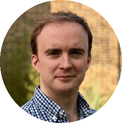
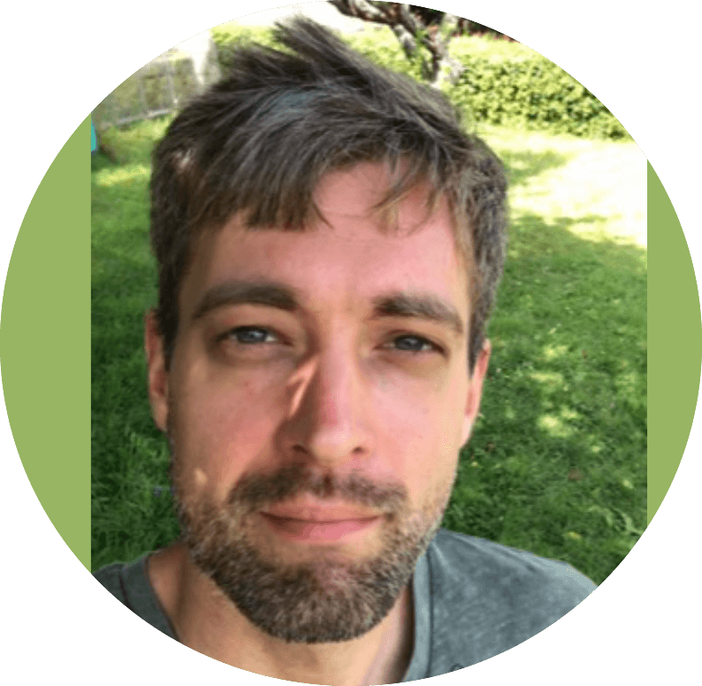
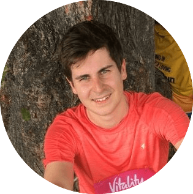
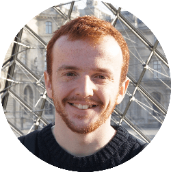

## Academics

<ul>
     <li style="display: flex; justify-content: flex-start; align-items: center">
      
      
 <a href="https://www.ucl.ac.uk/medical-imaging/staff/principal-investigators/professor-margaret-hall-craggs">Margaret Hall-Craggs </a> is a radiologist and Professor of Medical Imaging with a particular interest in magnetic resonance imaging. She is a fellow and silver medal winner of the International Society for Magnetic Resonance in Medicine. 

   </li>
   
   <li style="display: flex; justify-content: flex-start; align-items: center">
      
      
 <a href="https://TJPBray.github.io/">Tim Bray</a> is a radiologist using computational techniques for quantitative MRI. 

   </li>
</ul>

## Post-doctoral researchers

<ul>
   <li style="display: flex; justify-content: flex-start; align-items: center">
      
      
 <a href="https://csparker.github.io/">Christopher Parker</a> develops and applies disease progression models to stage Alzheimer's disease neurodegeneration. 

   </li>
   <li style="display: flex; justify-content: flex-start; align-items: center">
      
      
 <a href="https://scholar.google.com/citations?user=F9tsdJMAAAAJ&hl=en&oi=sra/">Michele Guerreri</a> develops and applies biophysical models for diffusion MRI. 

   </li>
   <li style="display: flex; justify-content: flex-start; align-items: center">
      
      
 <a href="https://tinggong.github.io/">Ting Gong</a> is interested in developing microstructure imaging methods with MRI and machine learning. 

   </li>
   <li style="display: flex; justify-content: flex-start; align-items: center">
      
      
 <a href="https://scholar.google.com/citations?user=iV_JtqIAAAAJ&hl=fr">Antoine Legouhy</a> is interested in: brain morphology, registration, atlasing (then); deep-learning registration, geometric distortion correction (now). 
 
   </li>
   <li style="display: flex; justify-content: flex-start; align-items: center">
      
      
 <a href="https://scholar.google.co.in/citations?user=B3gkCIEAAAAJ&hl=en">Prabhjot Kaur </a> is interested in developing machine learning methods to assess and improve the quality of medical images. 

   </li>
     
</ul>

## PhD students

<ul>
   <li style="display: flex; justify-content: flex-start; align-items: center">
      
      
 &nbsp; 

      
 <a href="https://seancepstein.github.io/">Sean Epstein</a> applies deep learning to medical imaging inverse problems. 

   </li>
   <li style="display: flex; justify-content: flex-start; align-items: center">
      
      
 <a href="https://TobyUCL.github.io/">Tobias (Toby) Goodwin-Allcock</a> develops machine learning networks to improve dMRI parameter estimation. 

   </li>
</ul>

## Alumni

<ul>
   <li style="display: flex; justify-content: flex-start; align-items: center">
      
      
  <a href="https://rcallagh.github.io/">Ross Callaghan</a> is a PhD graduate who created ConFiG, a tool to generate realistic white matter numerical phantoms for diffusion MRI simulations. Currently working for <a href="https://www.ainostics.com"> Ainostics</a>. 

   </li>
</ul>
